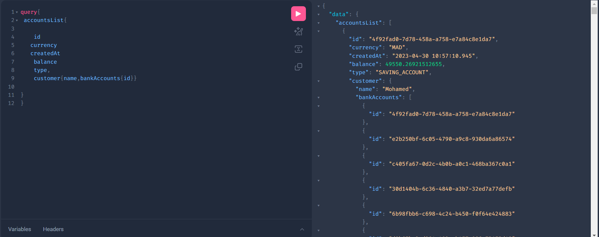
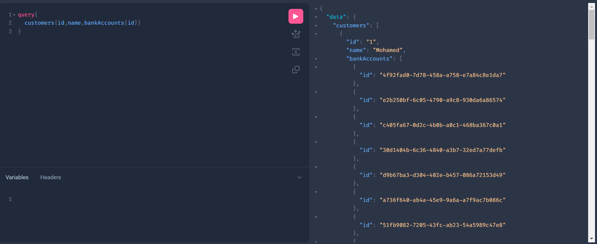
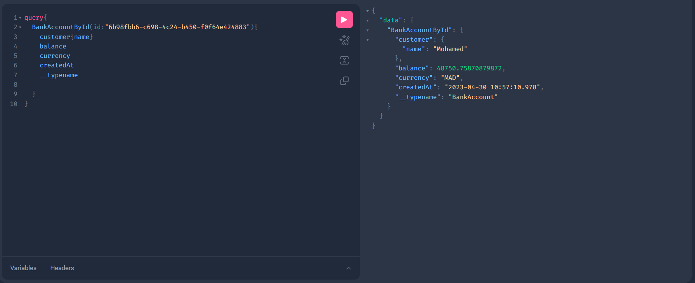
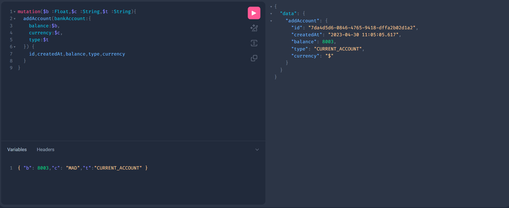
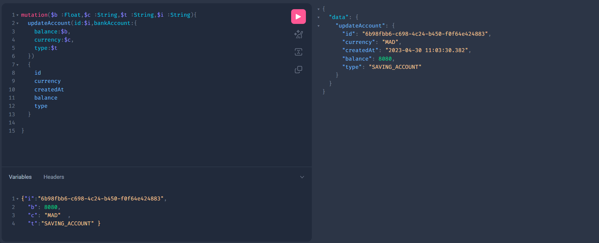
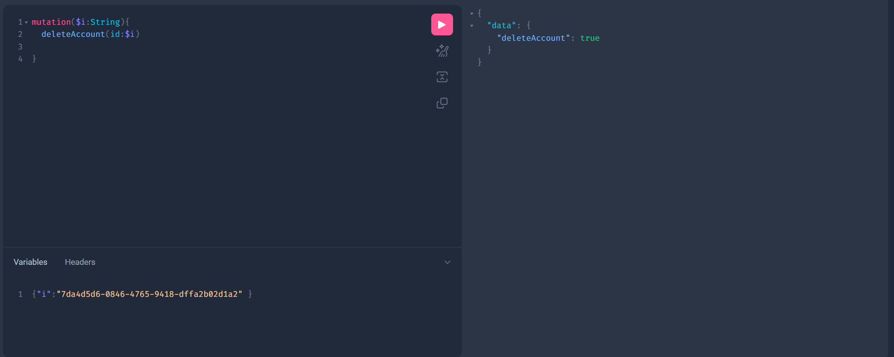

<H1  style="text-align:center"> BANKING API </H1> 
<H3>- ACCOUNT LIST</H3>

<H3>- CUSTOMER LIST</H3>

<H3>- FIND ACCOUNT BY ID</H3>

<H3>- ADD ACCOUNT</H3>

<H3>- UPDATE ACCOUNT</H3>

<H3>- DELETE ACCOUNT</H3>

